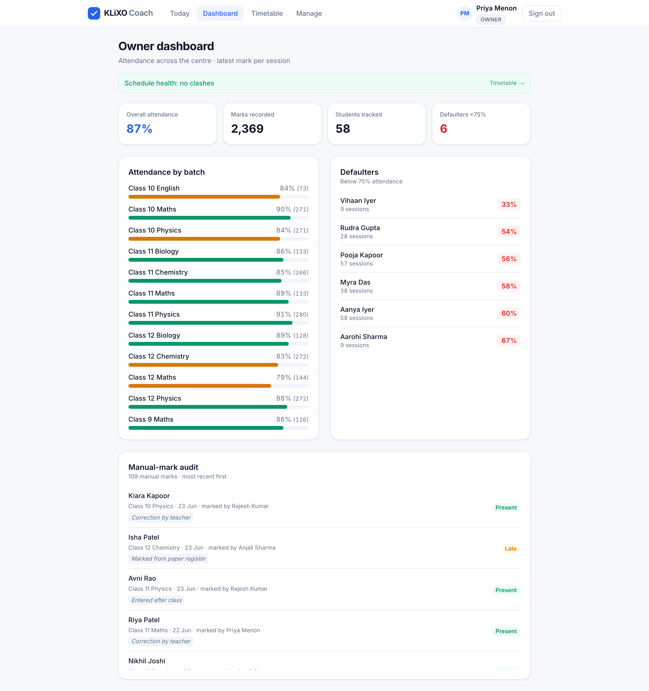
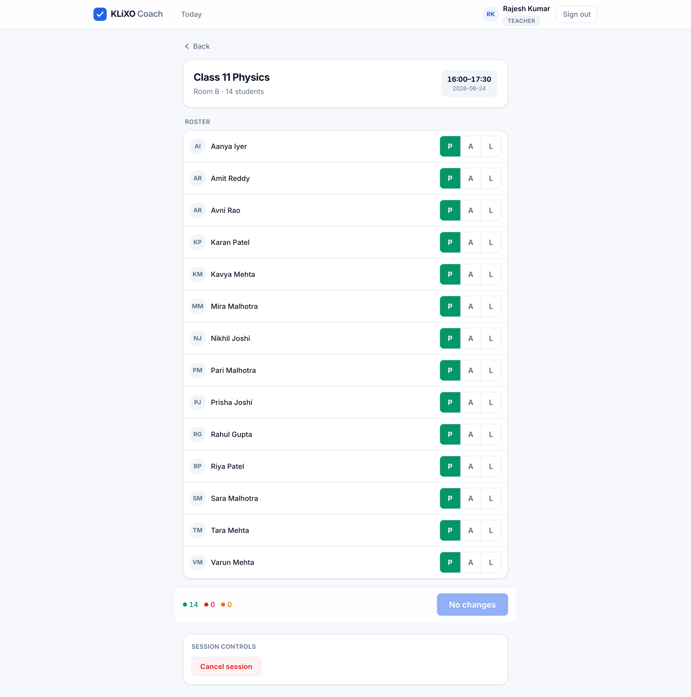
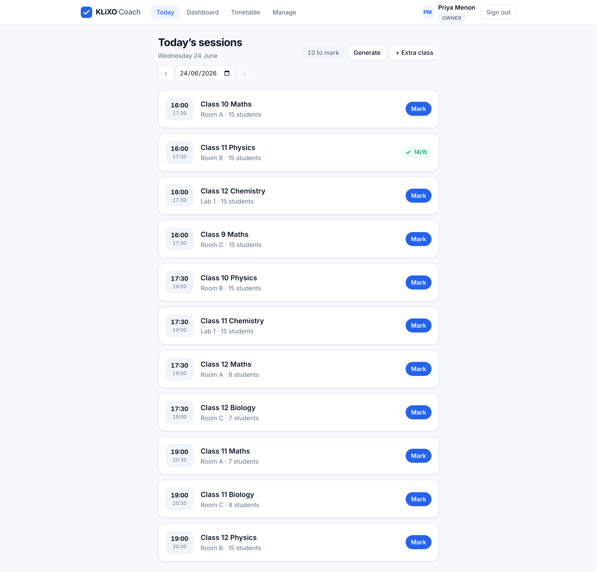
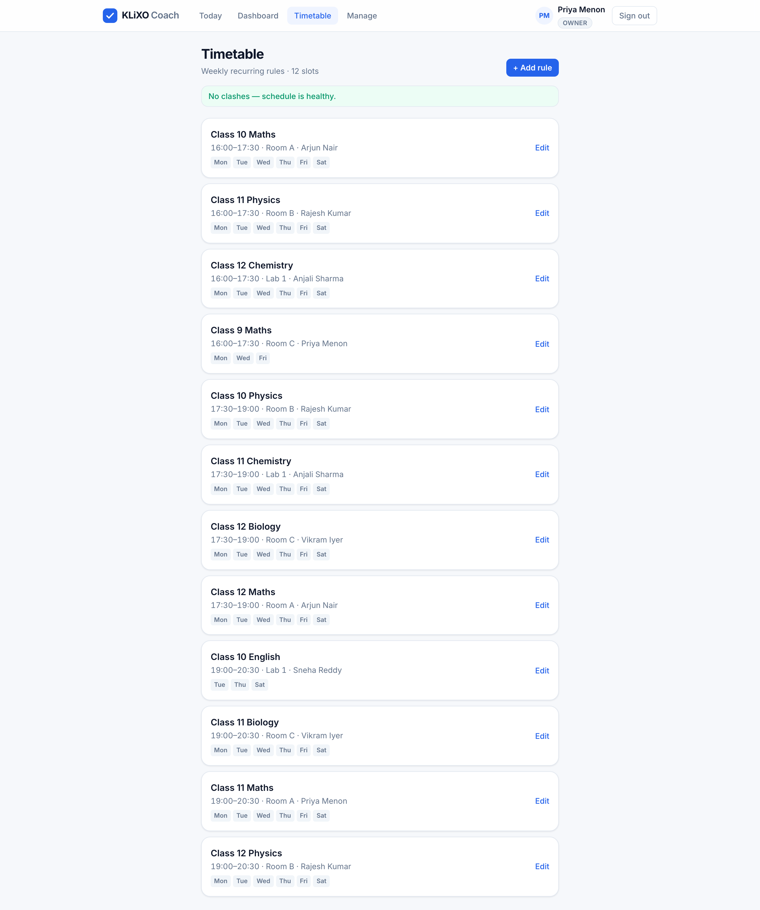

# 🎓 KLiXO Coach

**Attendance & timetable software for coaching centres.**
One branded deployment per centre. Owners see the truth of their attendance in real time.

---

## What it is

KLiXO Coach runs a coaching centre's day. Teachers open the app, see today's batches, and mark attendance in a few taps. Owners get a live dashboard: attendance percentage, who's falling behind, and a full audit of every mark. No spreadsheets to chase, no registers to add up at month end.

It's built as a real product, not a demo. Phone and PIN login, mobile first for teachers, and a clean owner view for the person who actually pays. Each centre gets its own branded deployment.

## Who it's for

- **Coaching centres and tuition institutes** that still track attendance on paper or WhatsApp.
- **Owners** who want to know, at a glance, which students are slipping and which batches are healthy.
- **Teachers** who need to mark a batch in under a minute, from a phone, between classes.

## Highlights

- 📱 **Teacher app** — see today's batches, mark the roster in a few taps, mobile first
- 📊 **Owner dashboard** — live attendance %, defaulter list, full manual-mark audit
- 🗓️ **Timetable** — batches, rooms and sessions in one place, with holiday handling
- 🔐 **Phone + PIN login** — teachers mark, students never self-mark, so the data stays honest
- 🌏 **Timezone-correct by design** — "today" is always the centre's local day
- 🎨 **One deployment per centre** — each institute gets its own branded instance

## A look inside

**Owner dashboard — attendance at a glance**

**Teacher marking a batch**

**Today view & timetable**
 

## Built with

Next.js 16 · TypeScript · Tailwind · Vercel

## Status

KLiXO Coach is a **live product**, currently rolling out to coaching centres one deployment at a time.

Interested in it for your centre, or in the product itself? Reach out.

 

**Tanishq Jain**
[tanishqjain.co](https://tanishqjain.co) · [github.com/Tjmafiabug](https://github.com/Tjmafiabug)

a KLiXO product

